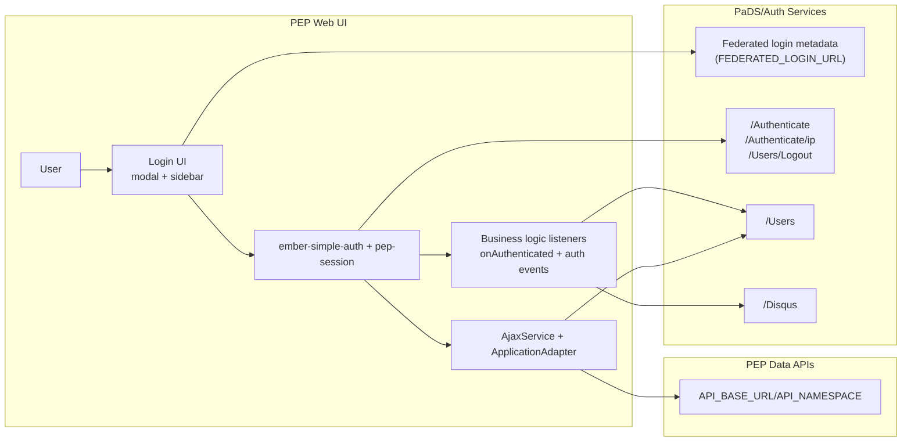
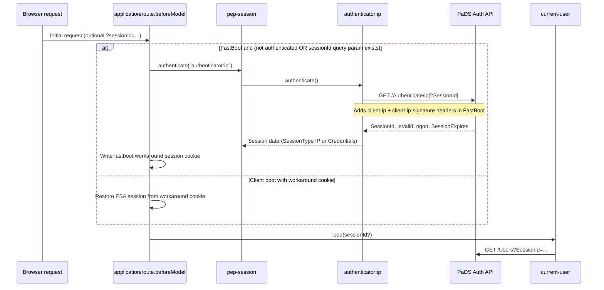
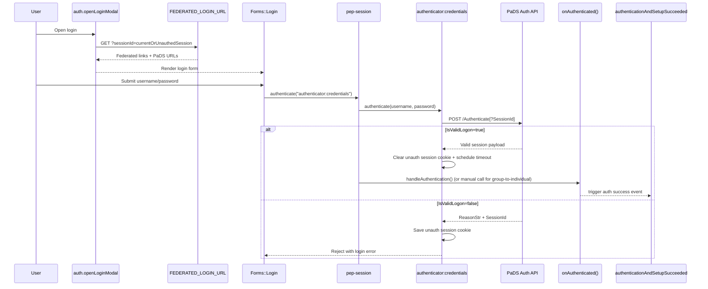
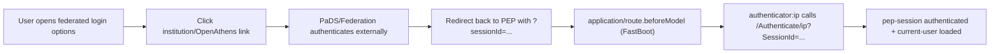
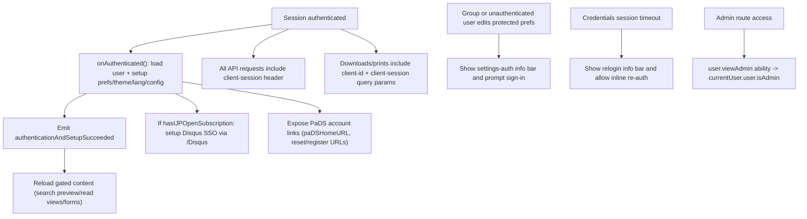

# Auth Reference (PEP UI + PaDS)

This document summarizes every auth method used by the UI, how each method reaches PaDS, and which business logic paths depend on auth state.

## Auth methods at a glance

| PaDS `loggedInMethod` value | User entry path | Authenticator path in app | PaDS touchpoints | Notes |
| --- | --- | --- | --- | --- |
| `Individual` | Username/password form (modal or sidebar) | `authenticator:credentials` | `POST /Authenticate`, `POST /Users/Logout` | Standard individual account login. |
| `IPAddress` | Institutional network access on SSR request | `authenticator:ip` | `GET /Authenticate/ip` | FastBoot-only IP check; uses signed IP header. |
| `Federated` | Federated/OpenAthens link from login dialog | External redirect, then `authenticator:ip` on return | Federated links endpoint (`FEDERATED_LOGIN_URL`), then `GET /Authenticate/ip?SessionId=...` | Federated auth is brokered by PaDS, then resolved into app session. |
| `ReferrerURL` | Referral/institution link from login dialog | External redirect, then `authenticator:ip` on return | Federated links endpoint (`FEDERATED_LOGIN_URL`), then `GET /Authenticate/ip?SessionId=...` | Same app-side resolution pattern as federated login. |
| `IPAddressIndividual` | Group/IP session upgraded with credentials | `authenticator:credentials` while already authenticated | `POST /Authenticate?SessionId=...` | Keeps group subscription context while attaching individual identity. |
| `FederatedIndividual` | Federated group session upgraded with credentials | `authenticator:credentials` while already authenticated | `POST /Authenticate?SessionId=...` | Same hybrid behavior as above. |
| `ReferrerURLIndividual` | Referral group session upgraded with credentials | `authenticator:credentials` while already authenticated | `POST /Authenticate?SessionId=...` | Same hybrid behavior as above. |

## End-to-end architecture

## Session bootstrap and IP auth (SSR path)

## Credential login flow (including group-to-individual upgrade)

## Federated/referrer handoff flow

## Business logic driven by auth state

## Core integration points in code

- Session/auth orchestration: `pep/app/services/pep-session.ts`, `pep/app/authenticators/credentials.ts`, `pep/app/authenticators/ip.ts`
- Login modal and federated link loading: `pep/app/services/auth.ts`, `pep/app/pods/components/forms/login/component.ts`, `pep/app/pods/components/modal-dialogs/user/federated-login/template.hbs`
- SSR bootstrap and IP auth trigger: `pep/app/pods/application/route.ts`
- Request headers and 401 handling: `pep/app/services/ajax.ts`, `pep/app/pods/application/adapter.ts`
- PaDS user model integration: `pep/app/pods/user/adapter.ts`, `pep/app/pods/user/serializer.ts`, `pep/app/services/current-user.ts`
- Auth-driven UI/business updates: `pep/app/utils/user.ts`, `pep/app/pods/components/information-bar/bars/relogin/component.ts`, `pep/app/pods/components/information-bar/bars/settings-auth/component.ts`
- PaDS account/self-service links in UI: `pep/app/pods/components/modal-dialogs/user/info/component.ts`, `pep/app/pods/components/forms/login/template.hbs`
